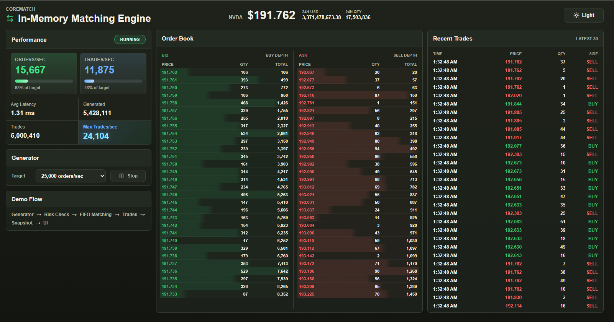
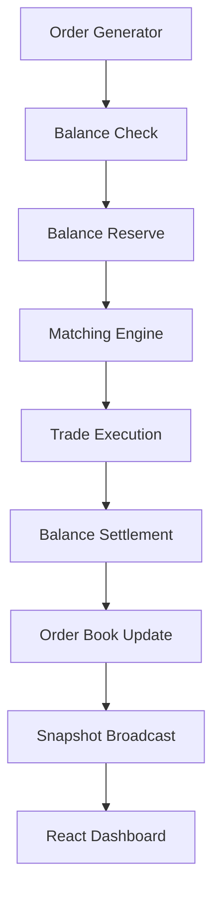

# CoreMatch

**High-Performance In-Memory Order Matching Engine**

> **Verified locally at 100,000 orders/sec on a 2-core development machine (16GB RAM).**

Go | React | WebSocket | Price-Time Priority | In-Memory Matching

## Dashboard Preview



---

## Live Demo

[Open CoreMatch](https://corematch.nexstack.xyz/)

Click **Start** to begin the live matching simulation.

---

## Demo

A 30-second demonstration of live order matching and market data streaming.

[CoreMatch Demo](docs/videoshots/corematch-in-memory-matching-engine-demo.mp4)

---

## Project Summary

CoreMatch is a Go-based in-memory order matching engine that demonstrates the core processing workflow of a modern exchange.

Designed around the hot path of order processing, the project focuses on matching logic, order books, market data streaming, and performance monitoring rather than user-facing trading functionality.

The implementation intentionally focuses on an in-memory matching engine while following common exchange-core design principles.

The project demonstrates:

- Order generation
- Balance reservation
- Price-time priority matching
- FIFO execution
- Live order book updates
- Snapshot-based market data streaming
- Real-time engine monitoring

---

## Quick Start

Backend:

```bash
cd backend
go run ./cmd/server
```

Frontend:

```bash
cd frontend
npm install
npm run dev
```

Default local URLs:

- Frontend: `http://127.0.0.1:5173`
- Backend: `http://127.0.0.1:8080`

---

## Overall Architecture

CoreMatch separates order generation, balance checks, balance reservation, matching, settlement, order book updates, snapshot building, and WebSocket delivery.

CoreMatch runs entirely in memory, focusing on the hot path of order matching and market data publishing. Lightweight market snapshots are streamed to the frontend through WebSocket.

---

## Order Processing Flow

Fake users and balances are initialized before the simulation starts.



1. **Order Generator**  
   The generator creates BUY and SELL orders at configurable target rates.

2. **Balance Check**  
   The backend checks whether the user has enough available balance for the order.

3. **Balance Reserve**  
   Required funds or assets are reserved before the order enters the matching engine.

4. **Matching Engine**  
   Orders are matched against the opposite side of the book using price-time priority.

5. **Trade Execution**  
   When prices cross, trades are produced immediately in memory.

6. **Balance Settlement**  
   Reserved balances are updated after execution.

7. **Order Book Update**  
   Remaining open quantity stays on the book at its price level.

8. **Snapshot Broadcast**  
   The backend builds lightweight market snapshots and sends them to the frontend through WebSocket.

9. **React Dashboard**  
   The UI replaces the latest snapshot instead of storing every order or every event.

---

## Matching Logic

CoreMatch uses **price-time priority**.

Orders are matched using two rules:

1. Best price first.
2. Earliest order first within the same price level.

For BUY orders:

- Higher price has priority.
- If price is the same, earlier order has priority.

For SELL orders:

- Lower price has priority.
- If price is the same, earlier order has priority.

Execution behavior:

- Orders at the same price level execute FIFO.
- Trades execute at the resting maker order price.
- Partial fills continue until the incoming order is fully filled or no crossing price remains.
- Any remaining quantity rests on the order book at its limit price.

Example:

```text
1. BUY  100 shares @ 192.50
2. BUY  100 shares @ 192.50
3. SELL 100 shares @ 192.50
```

The SELL order matches against the first BUY order because both BUY orders have the same price, and the first BUY arrived earlier.

---

## Fake Market Simulation

The fake market simulator generates controlled order flow to test matching behavior and dashboard updates.

The simulator is configurable for repeatable benchmark and demo scenarios.

The simulation includes:

- Fake users
- Fake balances
- BUY / SELL order generation
- Balance checks
- Balance reservations
- Matching pressure against the order book

The generator internally supports different pressure profiles:

- Normal
- Bullish
- Bearish

Supported simulation rates:

- 50 orders/sec
- 100 orders/sec
- 1,000 orders/sec
- 5,000 orders/sec
- 25,000 orders/sec
- 50,000 orders/sec
- 100,000 orders/sec

The default target rate is `25,000 orders/sec`.

The displayed metrics reflect actual engine processing on the local runtime environment.

---

## Live Dashboard

The dashboard is a monitoring surface for the in-memory engine.

### Performance

Shows live engine throughput and latency:

- Orders/sec
- Trades/sec
- Average latency
- Generated orders
- Executed trades
- Engine status

### Order Book

Shows live ASK and BID levels with cumulative totals.

Each side displays the latest visible depth from the snapshot stream.

### Recent Trades

Shows the latest executed trades with:

- Time
- Price
- Quantity
- Side

BUY and SELL trades are color-coded for quick visual scanning.

### Generator Controls

Controls the fake order generator target rate and start/stop state.

The control changes the target rate only. The performance cards still show actual backend throughput.

### Demo Flow

```text
Generator -> Risk Check -> FIFO Matching -> Trades -> Snapshot -> UI
```

This summarizes the live processing path shown in the dashboard.

---

## API and WebSocket

Backend endpoints:

| Method | Path | Purpose |
| --- | --- | --- |
| GET | `/healthz` | Health check |
| GET | `/api/snapshot` | Current market snapshot |
| GET | `/ws` | WebSocket upgrade for live snapshots |
| POST | `/api/generator/start` | Start order generator |
| POST | `/api/generator/stop` | Stop order generator |
| POST | `/api/generator/rate` | Update generator target rate |

---

## Performance Metrics

CoreMatch exposes live runtime metrics from the backend snapshot stream, including throughput, latency, order counters, trade counters, engine status, generator target rate, open orders, best bid, and best ask.

The dashboard receives periodic WebSocket snapshots that replace the previous UI state. The frontend displays the current engine state without receiving every order or storing historical events.

---

## Technology Stack

### Architecture

- Memory order book
- FIFO queue per price level
- Price-time priority
- Scaled integer accounting
- Snapshot-based UI updates

### Backend

- Go
- In-memory account service
- In-memory order book
- Matching engine
- Snapshot builder
- WebSocket broadcaster

### Frontend

- React
- TypeScript
- Vite
- WebSocket client

### Communication

- HTTP API for controls
- WebSocket for live snapshots

### Testing / Simulation

- Fake order generator
- Fake users
- Fake balances
- High-rate order submission

### Current Design Constraints

- In-memory only
- Single symbol
- No persistence layer
- No recovery layer


---

## Future Roadmap

- Binary journal
- Replay recovery
- Snapshot persistence
- Dedicated benchmark mode


---

## Design Philosophy

CoreMatch focuses on exchange-core concepts rather than user-facing trading features.

The project demonstrates how modern matching engines process orders, maintain an in-memory order book, and stream market data efficiently using snapshot-based updates.

Production concerns such as persistence, replay recovery, deposits, withdrawals, and margin trading are intentionally excluded from V1.

---

## License

MIT License.
